# Incident Response Playbook: Malware Detection on IBM QRadar SIEM

## Overview
- **Playbook ID**: IR-MAL-001
- **Version**: 1.0
- **Last Updated**: December 2025
- **Classification**: Internal Use Only
- **Objective**: Panduan respon insiden terhadap deteksi malware melalui IBM QRadar SIEM

---

## Flowchart Diagram

```mermaid
flowchart TD
    subgraph PHASE1["📡 PHASE 1: DETECTION & IDENTIFICATION"]
        A[🚨 Alert Triggered di QRadar] --> B{Tipe Alert?}
        B -->|Malware Signature| C[Review Offense Details]
        B -->|Anomaly Behavior| D[Analyze Log Source]
        B -->|IOC Match| E[Check Threat Intelligence]

        C --> F[Collect Initial Data]
        D --> F
        E --> F

        F --> G[/"Gather Information:
        • Source/Destination IP
        • Hostname & Username
        • Timestamp
        • Payload Hash
        • Process Name"/]

        G --> H{Valid Threat?}
        H -->|False Positive| I[Document & Close]
        I --> J[Update Tuning Rules]
        J --> END1[🔚 End]
    end

    subgraph PHASE2["🔍 PHASE 2: TRIAGE & ANALYSIS"]
        H -->|True Positive| K[Assign Severity Level]

        K --> L{Severity Level?}
        L -->|Critical/High| M[🔴 Immediate Escalation]
        L -->|Medium| N[🟡 Standard Response]
        L -->|Low| O[🟢 Monitor & Document]

        M --> P[Notify SOC Manager]
        N --> P
        O --> Q[Continue Monitoring]

        P --> R[/"Deep Analysis:
        • AQL Query Investigation
        • Network Flow Analysis
        • User Activity Review
        • Asset Criticality Check"/]

        R --> S{Malware Type?}
        S -->|Ransomware| T[🔒 Priority: Data Protection]
        S -->|Trojan/RAT| U[🕵️ Priority: C2 Detection]
        S -->|Worm| V[🐛 Priority: Spread Prevention]
        S -->|Cryptominer| W[⛏️ Priority: Resource Protection]
        S -->|Other| X[📋 Standard Procedure]
    end

    subgraph PHASE3["🛡️ PHASE 3: CONTAINMENT"]
        T --> Y[Initiate Containment]
        U --> Y
        V --> Y
        W --> Y
        X --> Y

        Y --> Z[/"Immediate Actions:
        • Isolate Infected Host
        • Block Malicious IP/Domain
        • Disable Compromised Account
        • Preserve Evidence"/]

        Z --> AA{Network Isolation?}
        AA -->|Yes| AB[VLAN Quarantine]
        AA -->|No| AC[Host-level Isolation]

        AB --> AD[Update QRadar Reference Set]
        AC --> AD

        AD --> AE[/"Add to Block Lists:
        • Malicious IPs
        • C2 Domains
        • File Hashes
        • Registry Keys"/]

        AE --> AF{Spread Detected?}
        AF -->|Yes| AG[Expand Containment Scope]
        AG --> AH[Hunt for Additional IOCs]
        AF -->|No| AH

        AH --> AI[/"QRadar Hunting Queries:
        • Related Network Connections
        • Similar Process Executions
        • Lateral Movement Signs"/]
    end

    subgraph PHASE4["🧹 PHASE 4: ERADICATION"]
        AI --> AJ[Begin Eradication]

        AJ --> AK[/"Eradication Steps:
        • Remove Malware Files
        • Clean Registry Entries
        • Terminate Malicious Processes
        • Remove Persistence Mechanisms"/]

        AK --> AL{Full Cleanup?}
        AL -->|No| AM[Reimage System]
        AL -->|Yes| AN[Verify Clean State]

        AM --> AN

        AN --> AO[/"Verification:
        • Run AV/EDR Scan
        • Check QRadar for New Alerts
        • Validate System Integrity
        • Review Running Processes"/]

        AO --> AP{System Clean?}
        AP -->|No| AJ
        AP -->|Yes| AQ[Proceed to Recovery]
    end

    subgraph PHASE5["🔄 PHASE 5: RECOVERY"]
        AQ --> AR[Plan Recovery]

        AR --> AS[/"Recovery Steps:
        • Restore from Clean Backup
        • Patch Vulnerabilities
        • Reset Credentials
        • Update Security Controls"/]

        AS --> AT[Gradual Network Reintegration]

        AT --> AU{Monitor Period}
        AU -->|24-72 Hours| AV[Enhanced Monitoring in QRadar]

        AV --> AW[/"Create Custom Rules:
        • Specific IOC Detection
        • Behavioral Patterns
        • Network Anomalies"/]

        AW --> AX{Reinfection?}
        AX -->|Yes| Y
        AX -->|No| AY[Return to Normal Operations]
    end

    subgraph PHASE6["📝 PHASE 6: POST-INCIDENT"]
        AY --> AZ[Post-Incident Review]

        AZ --> BA[/"Documentation:
        • Timeline of Events
        • Actions Taken
        • IOCs Discovered
        • Lessons Learned"/]

        BA --> BB[/"QRadar Improvements:
        • New Detection Rules
        • Updated Reference Sets
        • Enhanced Dashboards
        • Custom Reports"/]

        BB --> BC[Stakeholder Report]

        BC --> BD[/"Report Contents:
        • Executive Summary
        • Technical Details
        • Impact Assessment
        • Recommendations"/]

        BD --> BE[Update Playbook]
        BE --> BF[Training & Awareness]
        BF --> END2[🔚 Incident Closed]
    end

    Q --> PHASE2

    style PHASE1 fill:#1a1a2e,stroke:#e94560,stroke-width:2px
    style PHASE2 fill:#1a1a2e,stroke:#f9a825,stroke-width:2px
    style PHASE3 fill:#1a1a2e,stroke:#00bcd4,stroke-width:2px
    style PHASE4 fill:#1a1a2e,stroke:#9c27b0,stroke-width:2px
    style PHASE5 fill:#1a1a2e,stroke:#4caf50,stroke-width:2px
    style PHASE6 fill:#1a1a2e,stroke:#607d8b,stroke-width:2px

    style A fill:#e94560,stroke:#fff,stroke-width:2px,color:#fff
    style M fill:#f44336,stroke:#fff,stroke-width:2px,color:#fff
    style N fill:#ff9800,stroke:#fff,stroke-width:2px,color:#fff
    style O fill:#4caf50,stroke:#fff,stroke-width:2px,color:#fff
    style END1 fill:#607d8b,stroke:#fff,stroke-width:2px,color:#fff
    style END2 fill:#4caf50,stroke:#fff,stroke-width:2px,color:#fff
```



---

## Detail Fase Incident Response

### Phase 1: Detection & Identification

| Step | Action | QRadar Component | Responsible |
|------|--------|------------------|-------------|
| 1.1 | Monitor QRadar Offense Dashboard | Offense Management | SOC L1 |
| 1.2 | Review alert details & magnitude | Log Activity | SOC L1 |
| 1.3 | Validate IOC against Threat Intel | X-Force Integration | SOC L1 |
| 1.4 | Determine if True/False Positive | AQL Queries | SOC L1/L2 |

**QRadar AQL Query - Initial Investigation:**
```sql
SELECT sourceip, destinationip, username,
       LOGSOURCENAME(logsourceid), QIDNAME(qid),
       CATEGORYNAME(category), payload
FROM events
WHERE INOFFENSE(<offense_id>)
ORDER BY starttime DESC
LAST 24 HOURS
```

---

### Phase 2: Triage & Analysis

| Severity | Magnitude | Response Time | Escalation |
|----------|-----------|---------------|------------|
| Critical | 8-10 | < 15 minutes | Immediate to CISO |
| High | 6-7 | < 30 minutes | SOC Manager |
| Medium | 4-5 | < 2 hours | SOC Lead |
| Low | 1-3 | < 8 hours | Standard Queue |

**QRadar AQL Query - Deep Analysis:**
```sql
SELECT sourceip, destinationip, sourceport, destinationport,
       SUM(eventcount) as total_events,
       UNIQUECOUNT(username) as unique_users,
       FIRST(starttime) as first_seen,
       LAST(starttime) as last_seen
FROM events
WHERE sourceip = '<infected_ip>'
   OR destinationip = '<infected_ip>'
GROUP BY sourceip, destinationip, sourceport, destinationport
ORDER BY total_events DESC
LAST 7 DAYS
```

---

### Phase 3: Containment

**Immediate Containment Checklist:**
- [ ] Isolate infected host from network
- [ ] Block malicious IPs di firewall
- [ ] Add IOCs ke QRadar Reference Set
- [ ] Disable compromised user accounts
- [ ] Capture memory dump (jika memungkinkan)
- [ ] Preserve log evidence

**QRadar Reference Set Update:**
```bash
# Add malicious IP to reference set
/opt/qradar/bin/ReferenceSetUtil.sh add "Malicious_IPs" "<malicious_ip>"

# Add malicious domain
/opt/qradar/bin/ReferenceSetUtil.sh add "Malicious_Domains" "<malicious_domain>"

# Add file hash
/opt/qradar/bin/ReferenceSetUtil.sh add "Malicious_Hashes" "<file_hash>"
```

---

### Phase 4: Eradication

**Malware Removal Checklist:**
- [ ] Terminate malicious processes
- [ ] Delete malware files
- [ ] Remove registry persistence
- [ ] Clean scheduled tasks
- [ ] Remove malicious services
- [ ] Verify with EDR/AV scan

**QRadar Verification Query:**
```sql
SELECT LOGSOURCENAME(logsourceid), QIDNAME(qid),
       sourceip, username, payload
FROM events
WHERE sourceip = '<cleaned_host_ip>'
  AND (QIDNAME(qid) ILIKE '%malware%'
       OR QIDNAME(qid) ILIKE '%suspicious%'
       OR QIDNAME(qid) ILIKE '%threat%')
LAST 4 HOURS
```

---

### Phase 5: Recovery

**Recovery Steps:**
1. Validate system clean state
2. Restore dari backup (jika diperlukan)
3. Apply security patches
4. Reset semua credentials
5. Gradual network reintegration
6. Enhanced monitoring 24-72 jam

**QRadar Custom Rule - Post-Recovery Monitoring:**
```
Rule Name: Post-Incident Monitoring - <hostname>
Rule Type: Event
Test: when the event(s) were detected by one or more of these log sources <recovered_host_logsource>
      AND when any of these rules match <malware_detection_rules>
Rule Action: Create Offense, Send Email to SOC Team
```

---

### Phase 6: Post-Incident Activities

**Documentation Requirements:**
1. Incident Timeline
2. Attack Vector Analysis
3. IOC List (complete)
4. Actions Taken Log
5. Impact Assessment
6. Lessons Learned
7. Recommendations

**QRadar Improvements:**
- [ ] Create new custom rules
- [ ] Update reference sets
- [ ] Build custom dashboard
- [ ] Configure automated reports
- [ ] Tune existing rules (reduce false positives)

---

## RACI Matrix

| Activity | SOC L1 | SOC L2 | SOC Manager | CISO | IT Ops |
|----------|--------|--------|-------------|------|--------|
| Detection | R | I | I | - | - |
| Triage | R | A | I | - | - |
| Analysis | C | R | A | I | I |
| Containment | I | R | A | I | C |
| Eradication | - | R | A | I | C |
| Recovery | - | C | A | I | R |
| Reporting | C | R | A | R | I |

**R** = Responsible, **A** = Accountable, **C** = Consulted, **I** = Informed

---

## Contact Escalation

| Level | Role | Contact | Escalation Trigger |
|-------|------|---------|-------------------|
| 1 | SOC Analyst L1 | soc-l1@biofarma.co.id | Initial Alert |
| 2 | SOC Analyst L2 | soc-l2@biofarma.co.id | True Positive Confirmed |
| 3 | SOC Manager | soc-manager@biofarma.co.id | High/Critical Severity |
| 4 | CISO | ciso@biofarma.co.id | Major Incident |
| 5 | External IR | ir-vendor@external.com | APT/Major Breach |

---

## Appendix: Common Malware IOCs to Monitor

### Network-based IOCs
- Unusual outbound connections (port 4444, 5555, 8080)
- DNS queries to suspicious domains
- Beaconing patterns (regular interval connections)
- Large data exfiltration

### Host-based IOCs
- Suspicious process names
- Unusual registry modifications
- Scheduled tasks creation
- Service installations
- File drops in temp directories

### QRadar Log Sources to Monitor
- Endpoint Detection & Response (EDR)
- Antivirus/Antimalware
- Windows Event Logs
- Firewall Logs
- Proxy Logs
- DNS Logs
- Network Flow Data

---

**Document Control:**
| Version | Date | Author | Changes |
|---------|------|--------|---------|
| 1.0 | Dec 2025 | SOC Team | Initial Release |

---
*This playbook should be reviewed and updated quarterly or after significant incidents.*
